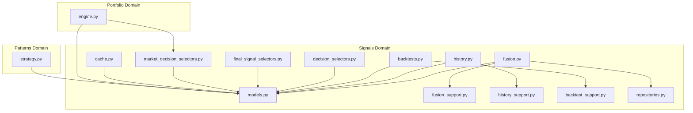
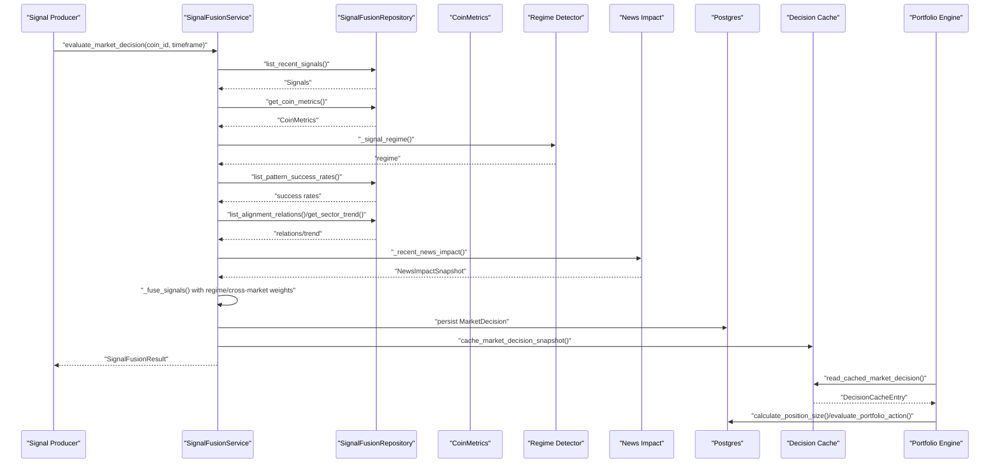
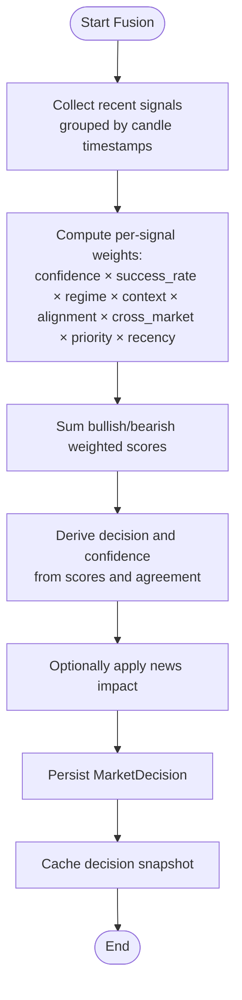
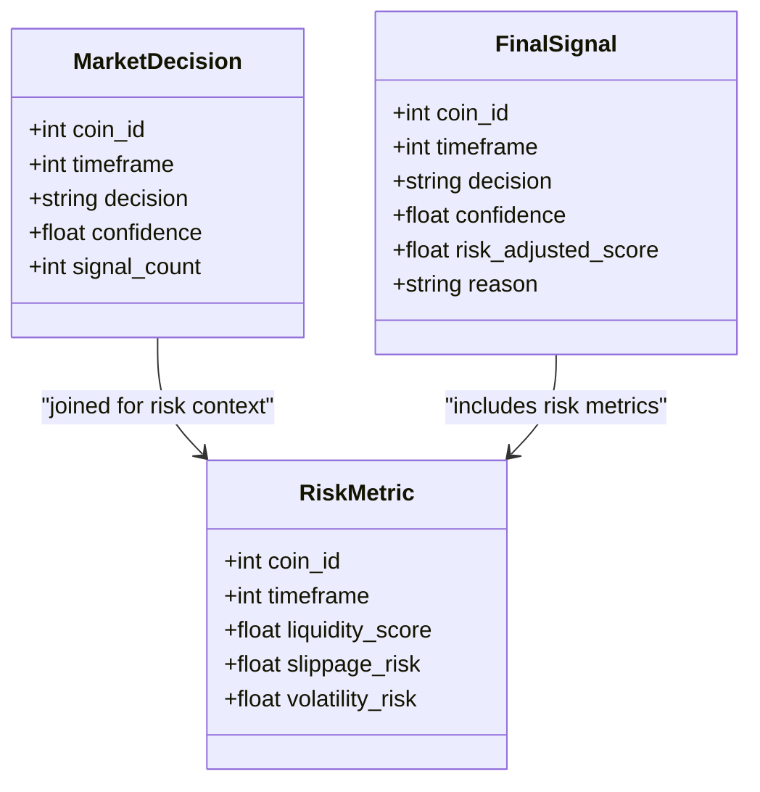
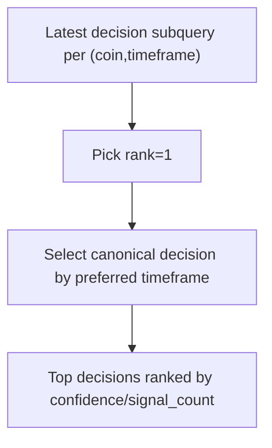
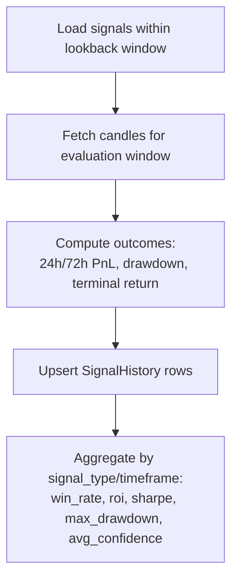
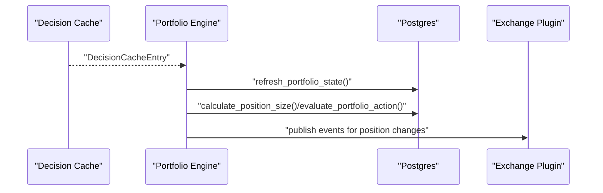
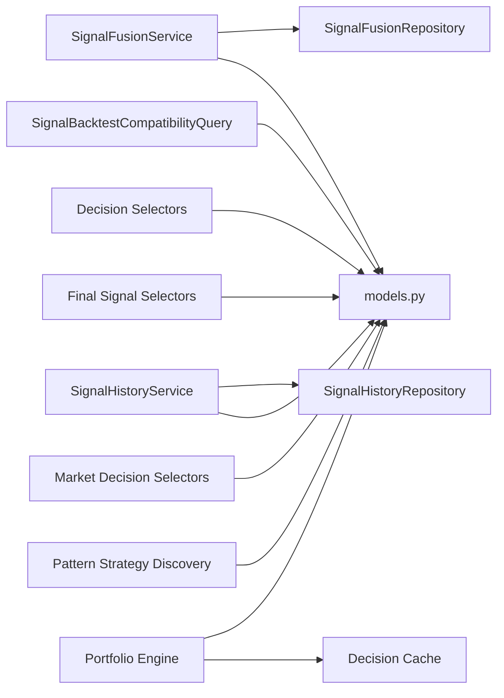
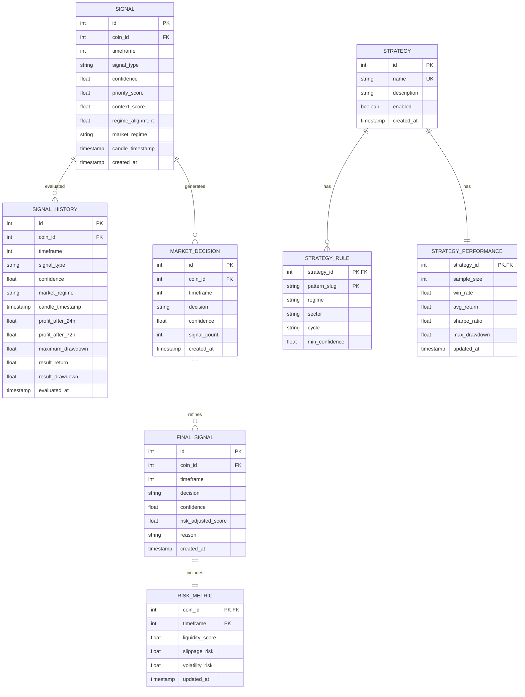

# Signal Generation Engine

<cite>
**Referenced Files in This Document**
- [models.py](file://src/apps/signals/models.py)
- [fusion.py](file://src/apps/signals/fusion.py)
- [fusion_support.py](file://src/apps/signals/fusion_support.py)
- [services.py](file://src/apps/signals/services.py)
- [history.py](file://src/apps/signals/history.py)
- [history_support.py](file://src/apps/signals/history_support.py)
- [backtests.py](file://src/apps/signals/backtests.py)
- [backtest_support.py](file://src/apps/signals/backtest_support.py)
- [decision_selectors.py](file://src/apps/signals/decision_selectors.py)
- [final_signal_selectors.py](file://src/apps/signals/final_signal_selectors.py)
- [market_decision_selectors.py](file://src/apps/signals/market_decision_selectors.py)
- [cache.py](file://src/apps/signals/cache.py)
- [repositories.py](file://src/apps/signals/repositories.py)
- [engine.py](file://src/apps/portfolio/engine.py)
- [strategy.py](file://src/apps/patterns/domain/strategy.py)
</cite>

## Table of Contents
1. [Introduction](#introduction)
2. [Project Structure](#project-structure)
3. [Core Components](#core-components)
4. [Architecture Overview](#architecture-overview)
5. [Detailed Component Analysis](#detailed-component-analysis)
6. [Dependency Analysis](#dependency-analysis)
7. [Performance Considerations](#performance-considerations)
8. [Troubleshooting Guide](#troubleshooting-guide)
9. [Conclusion](#conclusion)
10. [Appendices](#appendices)

## Introduction
This document describes the signal generation engine responsible for multi-source signal fusion, risk-adjusted scoring, decision conflict resolution, backtesting, historical signal analysis, and integration with portfolio management. It explains how signals are scored, fused across timeframes and sources, validated against market regimes, and transformed into actionable decisions and final risk-adjusted signals. It also covers performance evaluation metrics, strategy development, parameter optimization, and signal validation processes.

## Project Structure
The signal generation engine spans several modules:
- Models define persistent entities for signals, histories, decisions, and strategies.
- Fusion logic aggregates heterogeneous signals into unified market decisions.
- History and backtesting modules compute realized outcomes and performance metrics.
- Selectors expose read models for decisions and final signals.
- Cache stores recent decisions for fast retrieval.
- Portfolio integration translates decisions into position sizing and actions.
- Strategy discovery auto-generates and evaluates reusable trading strategies.

**Diagram sources**
- [models.py:15-236](file://src/apps/signals/models.py#L15-L236)
- [fusion.py:1-457](file://src/apps/signals/fusion.py#L1-L457)
- [fusion_support.py:1-206](file://src/apps/signals/fusion_support.py#L1-L206)
- [history.py:1-270](file://src/apps/signals/history.py#L1-L270)
- [history_support.py:1-149](file://src/apps/signals/history_support.py#L1-L149)
- [backtests.py:1-271](file://src/apps/signals/backtests.py#L1-L271)
- [backtest_support.py:1-70](file://src/apps/signals/backtest_support.py#L1-L70)
- [decision_selectors.py:1-245](file://src/apps/signals/decision_selectors.py#L1-L245)
- [final_signal_selectors.py:1-281](file://src/apps/signals/final_signal_selectors.py#L1-L281)
- [market_decision_selectors.py:1-303](file://src/apps/signals/market_decision_selectors.py#L1-L303)
- [cache.py:1-175](file://src/apps/signals/cache.py#L1-L175)
- [repositories.py:1-324](file://src/apps/signals/repositories.py#L1-L324)
- [engine.py:1-608](file://src/apps/portfolio/engine.py#L1-L608)
- [strategy.py:1-491](file://src/apps/patterns/domain/strategy.py#L1-L491)

**Section sources**
- [models.py:15-236](file://src/apps/signals/models.py#L15-L236)
- [fusion.py:1-457](file://src/apps/signals/fusion.py#L1-L457)
- [services.py:1-849](file://src/apps/signals/services.py#L1-L849)

## Core Components
- Signal entity: captures type, confidence, priority, context, regime alignment, and candle timestamp.
- SignalHistory: stores realized outcomes (24h/72h PnL, drawdown, returns) and evaluation metadata.
- MarketDecision: unified decision per coin/timeframe with confidence and signal count.
- FinalSignal: risk-adjusted decision with risk metrics and reason.
- Strategy/StrategyRule/StrategyPerformance: auto-discovered, rule-based strategies with performance stats.
- Fusion service: multi-source fusion pipeline with regime-aware weighting and news impact.
- History service: computes outcomes for historical signals and persists results.
- Backtests: aggregates historical outcomes into performance summaries.
- Decision selectors: canonical decision selection across timeframes and sectors.
- Portfolio engine: converts decisions into position sizing, stops, and actions.

**Section sources**
- [models.py:15-236](file://src/apps/signals/models.py#L15-L236)
- [fusion.py:209-242](file://src/apps/signals/fusion.py#L209-L242)
- [services.py:168-417](file://src/apps/signals/services.py#L168-L417)
- [history.py:82-186](file://src/apps/signals/history.py#L82-L186)
- [backtests.py:26-170](file://src/apps/signals/backtests.py#L26-L170)
- [decision_selectors.py:90-214](file://src/apps/signals/decision_selectors.py#L90-L214)
- [final_signal_selectors.py:96-250](file://src/apps/signals/final_signal_selectors.py#L96-L250)
- [market_decision_selectors.py:94-270](file://src/apps/signals/market_decision_selectors.py#L94-L270)
- [engine.py:248-403](file://src/apps/portfolio/engine.py#L248-L403)
- [strategy.py:334-441](file://src/apps/patterns/domain/strategy.py#L334-L441)

## Architecture Overview
The engine orchestrates multi-source fusion, regime-aware scoring, and decision caching, feeding downstream analytics and portfolio actions.

**Diagram sources**
- [services.py:235-417](file://src/apps/signals/services.py#L235-L417)
- [fusion.py:290-400](file://src/apps/signals/fusion.py#L290-L400)
- [repositories.py:99-324](file://src/apps/signals/repositories.py#L99-L324)
- [cache.py:111-175](file://src/apps/signals/cache.py#L111-L175)
- [engine.py:248-403](file://src/apps/portfolio/engine.py#L248-L403)

## Detailed Component Analysis

### Multi-Source Signal Fusion
- Recent signals are collected per timeframe and grouped by candle timestamp windows.
- Weighted score computation factors:
  - Confidence and priority score
  - Pattern success rate by slug and regime
  - Context factor and regime alignment
  - Cross-market alignment weight (leadership and sector trend)
  - Recency decay
- Decision derived from bullish/bearish scores with agreement normalization.
- Optional news impact aggregation with recency-weighted sentiment.

**Diagram sources**
- [fusion.py:209-242](file://src/apps/signals/fusion.py#L209-L242)
- [fusion_support.py:94-187](file://src/apps/signals/fusion_support.py#L94-L187)
- [services.py:585-645](file://src/apps/signals/services.py#L585-L645)

**Section sources**
- [fusion.py:50-125](file://src/apps/signals/fusion.py#L50-L125)
- [fusion_support.py:94-187](file://src/apps/signals/fusion_support.py#L94-L187)
- [services.py:585-645](file://src/apps/signals/services.py#L585-L645)

### Risk-Adjusted Scoring and Final Signals
- FinalSignal extends MarketDecision with risk-adjusted score and risk metrics (liquidity, slippage, volatility).
- Canonical decision selection prioritizes higher timeframes (daily > 4hr > hourly > 15m).
- Risk metrics are joined to provide transparency for risk-adjusted scoring.

**Diagram sources**
- [models.py:106-166](file://src/apps/signals/models.py#L106-L166)
- [final_signal_selectors.py:96-250](file://src/apps/signals/final_signal_selectors.py#L96-L250)

**Section sources**
- [final_signal_selectors.py:96-250](file://src/apps/signals/final_signal_selectors.py#L96-L250)
- [models.py:106-166](file://src/apps/signals/models.py#L106-L166)

### Decision Conflict Resolution
- Latest decision per coin/timeframe is determined via row_number partitioning.
- Canonical decision preference order: daily → 4hr → hourly → 15m.
- MarketDecision selectors provide top decisions ranked by confidence/signal count.

**Diagram sources**
- [decision_selectors.py:24-87](file://src/apps/signals/decision_selectors.py#L24-L87)
- [market_decision_selectors.py:29-91](file://src/apps/signals/market_decision_selectors.py#L29-L91)

**Section sources**
- [decision_selectors.py:90-214](file://src/apps/signals/decision_selectors.py#L90-L214)
- [market_decision_selectors.py:94-270](file://src/apps/signals/market_decision_selectors.py#L94-L270)

### Backtesting Framework and Historical Signal Analysis
- Historical outcomes computed for signals within a rolling lookback window.
- Outcome metrics include profit after 24h/72h, maximum drawdown, and terminal return/drawdown.
- Backtests aggregate outcomes by signal type/timeframe into performance summaries (win rate, ROI, Sharpe, max drawdown, average confidence).

**Diagram sources**
- [history.py:82-186](file://src/apps/signals/history.py#L82-L186)
- [history_support.py:90-132](file://src/apps/signals/history_support.py#L90-L132)
- [backtests.py:26-170](file://src/apps/signals/backtests.py#L26-L170)
- [backtest_support.py:34-61](file://src/apps/signals/backtest_support.py#L34-L61)

**Section sources**
- [history.py:82-186](file://src/apps/signals/history.py#L82-L186)
- [history_support.py:90-132](file://src/apps/signals/history_support.py#L90-L132)
- [backtests.py:26-170](file://src/apps/signals/backtests.py#L26-L170)
- [backtest_support.py:34-61](file://src/apps/signals/backtest_support.py#L34-L61)

### Performance Evaluation Metrics
- Metrics include sample size, win rate, ROI, average return, Sharpe ratio, max drawdown, and average confidence.
- Sharpe ratio computed from realized returns series.

**Section sources**
- [backtest_support.py:24-61](file://src/apps/signals/backtest_support.py#L24-L61)
- [backtests.py:120-170](file://src/apps/signals/backtests.py#L120-L170)

### Signal Types, Confidence Scoring, Time Horizon, and Market Regime Adaptation
- Signal types supported include pattern-based archetypes (continuation, reversal, breakout, mean reversion).
- Confidence scoring integrates priority score, context score, regime alignment, and pattern success rates.
- Timeframe coverage includes 15m, 60m, 240m, and 1440m; evaluation horizons vary by timeframe.
- Regime adaptation adjusts weights by market regime and pattern archetype.

**Section sources**
- [fusion_support.py:101-143](file://src/apps/signals/fusion_support.py#L101-L143)
- [history_support.py:15-20](file://src/apps/signals/history_support.py#L15-L20)
- [services.py:575-584](file://src/apps/signals/services.py#L575-L584)

### Signal History Management and Real-Time Generation
- Real-time fusion writes MarketDecision entries and caches snapshots for immediate reads.
- Cache TTL and LRU clients enable fast retrieval for portfolio integration.
- MarketDecision selectors provide canonical decisions and top-ranked lists.

**Section sources**
- [cache.py:111-175](file://src/apps/signals/cache.py#L111-L175)
- [market_decision_selectors.py:94-270](file://src/apps/signals/market_decision_selectors.py#L94-L270)
- [services.py:168-417](file://src/apps/signals/services.py#L168-L417)

### Integration with Portfolio Management
- Portfolio engine reads cached decisions and calculates position sizes considering regime, volatility, and sector exposure.
- Stops and take-profit targets derived from ATR; actions include open/close/increase/decrease/hold.
- Portfolio state tracks total/allocated/available capital and open positions.

**Diagram sources**
- [cache.py:163-175](file://src/apps/signals/cache.py#L163-L175)
- [engine.py:248-403](file://src/apps/portfolio/engine.py#L248-L403)

**Section sources**
- [engine.py:248-403](file://src/apps/portfolio/engine.py#L248-L403)
- [cache.py:111-175](file://src/apps/signals/cache.py#L111-L175)

### Strategy Development, Parameter Optimization, and Signal Validation
- Auto-discovery builds strategy candidates from tokenized signal patterns, regime, sector, and cycle filters.
- Strategies are upserted with rules and performance metrics; enabling criteria include minimum sample size, win rate, Sharpe, and max drawdown.
- Strategy alignment returns confidence boost for matching strategies.

**Section sources**
- [strategy.py:193-441](file://src/apps/patterns/domain/strategy.py#L193-L441)

## Dependency Analysis
Key dependencies and coupling:
- Fusion depends on repositories for metrics, relations, sector trend, and pattern success rates.
- History depends on candles and evaluation helpers; backtests depend on SignalHistory outcomes.
- Decisions and final signals depend on read models and risk metrics.
- Portfolio depends on cached decisions and market metrics.

**Diagram sources**
- [services.py:168-417](file://src/apps/signals/services.py#L168-L417)
- [repositories.py:99-324](file://src/apps/signals/repositories.py#L99-L324)
- [history.py:63-186](file://src/apps/signals/history.py#L63-L186)
- [backtests.py:26-170](file://src/apps/signals/backtests.py#L26-L170)
- [decision_selectors.py:90-214](file://src/apps/signals/decision_selectors.py#L90-L214)
- [final_signal_selectors.py:96-250](file://src/apps/signals/final_signal_selectors.py#L96-L250)
- [market_decision_selectors.py:94-270](file://src/apps/signals/market_decision_selectors.py#L94-L270)
- [engine.py:248-403](file://src/apps/portfolio/engine.py#L248-L403)
- [strategy.py:334-441](file://src/apps/patterns/domain/strategy.py#L334-L441)

**Section sources**
- [services.py:168-417](file://src/apps/signals/services.py#L168-L417)
- [repositories.py:99-324](file://src/apps/signals/repositories.py#L99-L324)

## Performance Considerations
- Fusion limits recent signals and candle groups to cap computational cost.
- News impact caps sentiment scores and limits item counts.
- Cache reduces repeated database reads for decisions.
- Batch backtests and history refresh process signals in groups by coin/timeframe.
- Asynchronous repositories enable efficient I/O during fusion and history updates.

[No sources needed since this section provides general guidance]

## Troubleshooting Guide
Common issues and resolutions:
- No signals found for fusion: verify recent signals exist and timeframe is among allowed fusion timeframes.
- Decision unchanged: material confidence delta threshold prevents redundant writes; confirm regime and signal composition changes.
- Missing candles for history evaluation: ensure sufficient historical candles around signal timestamps; otherwise outcomes remain null.
- Portfolio action skipped: check decision availability, portfolio capital, sector exposure, and maximum positions constraints.

**Section sources**
- [fusion.py:306-350](file://src/apps/signals/fusion.py#L306-L350)
- [history.py:117-137](file://src/apps/signals/history.py#L117-L137)
- [engine.py:256-288](file://src/apps/portfolio/engine.py#L256-L288)

## Conclusion
The signal generation engine combines multi-source signals with regime-aware scoring, cross-market alignment, and news sentiment to produce robust market decisions. Historical outcomes and backtests provide objective performance evaluation, while final signals incorporate risk metrics for disciplined portfolio integration. Auto-discovered strategies further enhance adaptability across market conditions.

[No sources needed since this section summarizes without analyzing specific files]

## Appendices

### Data Model Overview

**Diagram sources**
- [models.py:15-236](file://src/apps/signals/models.py#L15-L236)