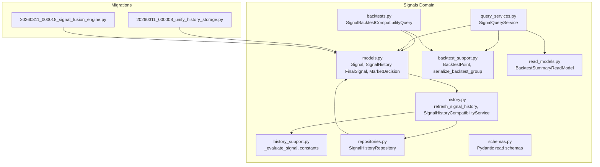
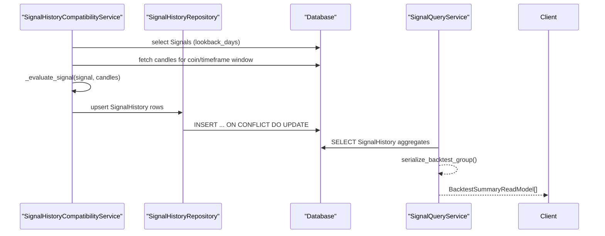
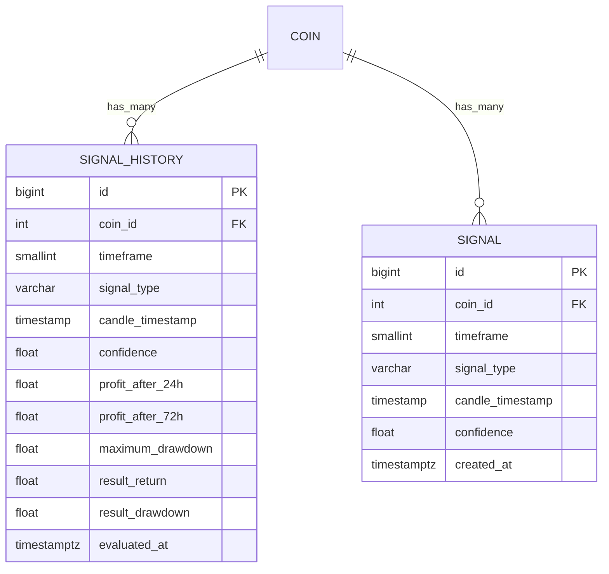
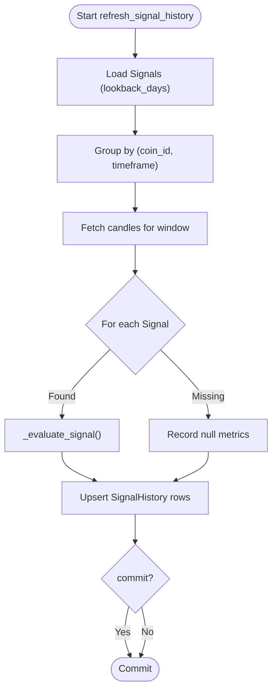
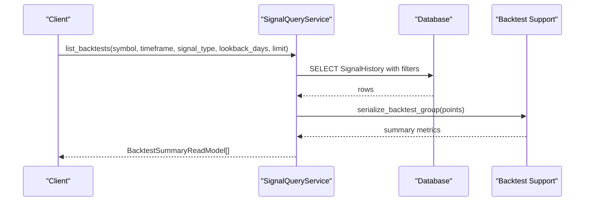
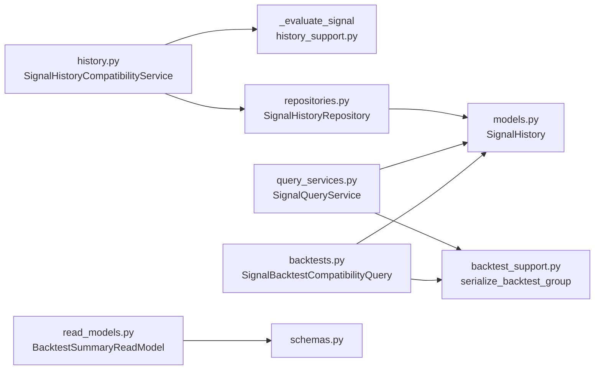

# Signal History Management

<cite>
**Referenced Files in This Document**
- [history.py](file://src/apps/signals/history.py)
- [history_support.py](file://src/apps/signals/history_support.py)
- [models.py](file://src/apps/signals/models.py)
- [repositories.py](file://src/apps/signals/repositories.py)
- [query_services.py](file://src/apps/signals/query_services.py)
- [backtest_support.py](file://src/apps/signals/backtest_support.py)
- [backtests.py](file://src/apps/signals/backtests.py)
- [read_models.py](file://src/apps/signals/read_models.py)
- [schemas.py](file://src/apps/signals/schemas.py)
- [20260311_000008_unify_history_storage.py](file://src/migrations/versions/20260311_000008_unify_history_storage.py)
- [20260311_000018_signal_fusion_engine.py](file://src/migrations/versions/20260311_000018_signal_fusion_engine.py)
</cite>

## Table of Contents
1. [Introduction](#introduction)
2. [Project Structure](#project-structure)
3. [Core Components](#core-components)
4. [Architecture Overview](#architecture-overview)
5. [Detailed Component Analysis](#detailed-component-analysis)
6. [Dependency Analysis](#dependency-analysis)
7. [Performance Considerations](#performance-considerations)
8. [Troubleshooting Guide](#troubleshooting-guide)
9. [Conclusion](#conclusion)
10. [Appendices](#appendices)

## Introduction
This document explains the signal history management system that powers historical signal storage, evaluation, retrieval, and analytics. It covers:
- Persistence architecture and lifecycle of historical signal records
- Evaluation workflow for performance tracking and result recording
- Historical analysis capabilities and integration with performance metrics
- Indexing strategies for efficient historical queries
- Backtesting integration and statistical summaries

## Project Structure
The signal history subsystem spans models, repositories, services, and migrations that define storage, evaluation, and analytics.

**Diagram sources**
- [models.py:15-81](file://src/apps/signals/models.py#L15-L81)
- [history.py:63-202](file://src/apps/signals/history.py#L63-L202)
- [history_support.py:13-149](file://src/apps/signals/history_support.py#L13-L149)
- [repositories.py:23-96](file://src/apps/signals/repositories.py#L23-L96)
- [query_services.py:131-869](file://src/apps/signals/query_services.py#L131-L869)
- [backtest_support.py:9-70](file://src/apps/signals/backtest_support.py#L9-L70)
- [backtests.py:26-208](file://src/apps/signals/backtests.py#L26-L208)
- [read_models.py:135-148](file://src/apps/signals/read_models.py#L135-L148)
- [schemas.py:180-203](file://src/apps/signals/schemas.py#L180-L203)
- [20260311_000008_unify_history_storage.py:19-35](file://src/migrations/versions/20260311_000008_unify_history_storage.py#L19-L35)
- [20260311_000018_signal_fusion_engine.py:18-41](file://src/migrations/versions/20260311_000018_signal_fusion_engine.py#L18-L41)

**Section sources**
- [models.py:15-81](file://src/apps/signals/models.py#L15-L81)
- [history.py:63-202](file://src/apps/signals/history.py#L63-L202)
- [history_support.py:13-149](file://src/apps/signals/history_support.py#L13-L149)
- [repositories.py:23-96](file://src/apps/signals/repositories.py#L23-L96)
- [query_services.py:131-869](file://src/apps/signals/query_services.py#L131-L869)
- [backtest_support.py:9-70](file://src/apps/signals/backtest_support.py#L9-L70)
- [backtests.py:26-208](file://src/apps/signals/backtests.py#L26-L208)
- [read_models.py:135-148](file://src/apps/signals/read_models.py#L135-L148)
- [schemas.py:180-203](file://src/apps/signals/schemas.py#L180-L203)
- [20260311_000008_unify_history_storage.py:19-35](file://src/migrations/versions/20260311_000008_unify_history_storage.py#L19-L35)
- [20260311_000018_signal_fusion_engine.py:18-41](file://src/migrations/versions/20260311_000018_signal_fusion_engine.py#L18-L41)

## Core Components
- SignalHistory: Persistent table storing per-signal evaluation outcomes and metrics.
- SignalHistoryRepository: Asynchronous repository for listing signals and upserting history rows.
- SignalHistoryCompatibilityService: Legacy-compatible service to compute and persist evaluation results.
- SignalQueryService: Query service aggregating historical results into backtest summaries and analytics.
- Backtest support utilities: Data structures and functions to compute Sharpe ratio, serialize groups, and clamp values.
- Migrations: Schema unification and indices for efficient historical queries.

Key responsibilities:
- Historical storage: SignalHistory persists profit windows, drawdowns, and evaluation timestamps.
- Evaluation: _evaluate_signal computes returns/drawdowns over 24h/72h windows aligned to candle timestamps.
- Retrieval: Repositories and query services provide paginated, filtered access to signals and backtests.
- Analytics: Backtest summaries expose ROI, win rate, Sharpe ratio, and max drawdown.

**Section sources**
- [models.py:52-81](file://src/apps/signals/models.py#L52-L81)
- [repositories.py:23-96](file://src/apps/signals/repositories.py#L23-L96)
- [history.py:63-202](file://src/apps/signals/history.py#L63-L202)
- [history_support.py:34-132](file://src/apps/signals/history_support.py#L34-L132)
- [query_services.py:795-865](file://src/apps/signals/query_services.py#L795-L865)
- [backtest_support.py:9-70](file://src/apps/signals/backtest_support.py#L9-L70)

## Architecture Overview
The system evaluates signals against historical candle data and writes performance metrics into SignalHistory. Queries aggregate these metrics into backtest summaries.

**Diagram sources**
- [history.py:82-186](file://src/apps/signals/history.py#L82-L186)
- [repositories.py:69-96](file://src/apps/signals/repositories.py#L69-L96)
- [query_services.py:795-865](file://src/apps/signals/query_services.py#L795-L865)
- [backtest_support.py:34-61](file://src/apps/signals/backtest_support.py#L34-L61)

## Detailed Component Analysis

### SignalHistory Persistence Model
SignalHistory stores per-signal evaluation results with unique composite keys and supporting indexes for fast reads.

- Unique constraint ensures one evaluation per coin/timeframe/signal/candle_timestamp.
- Indexes optimize descending timestamp scans and signal-type lookups.

**Diagram sources**
- [models.py:52-81](file://src/apps/signals/models.py#L52-L81)

**Section sources**
- [models.py:52-81](file://src/apps/signals/models.py#L52-L81)

### Evaluation Workflow and Outcome Recording
The evaluation pipeline:
- Loads recent signals within a lookback window.
- Fetches candles for the relevant coin/timeframe covering the evaluation horizon.
- Computes directional bias from signal type and confidence.
- Determines 24h/72h return windows and maximum drawdown along the path.
- Upserts SignalHistory with results and timestamps.

**Diagram sources**
- [history.py:82-186](file://src/apps/signals/history.py#L82-L186)
- [history_support.py:90-132](file://src/apps/signals/history_support.py#L90-L132)

**Section sources**
- [history.py:82-186](file://src/apps/signals/history.py#L82-L186)
- [history_support.py:90-132](file://src/apps/signals/history_support.py#L90-L132)

### Historical Retrieval and Backtesting Integration
Historical queries filter SignalHistory by symbol, timeframe, and signal_type, then group points by signal_type/timeframe to compute aggregated metrics.

**Diagram sources**
- [query_services.py:585-691](file://src/apps/signals/query_services.py#L585-L691)
- [query_services.py:795-865](file://src/apps/signals/query_services.py#L795-L865)
- [backtest_support.py:34-61](file://src/apps/signals/backtest_support.py#L34-L61)

**Section sources**
- [query_services.py:585-691](file://src/apps/signals/query_services.py#L585-L691)
- [query_services.py:795-865](file://src/apps/signals/query_services.py#L795-L865)
- [backtest_support.py:34-61](file://src/apps/signals/backtest_support.py#L34-L61)

### Data Lifecycle and Archival Policies
- Lookback windows: Default 365 days for history refresh and backtests.
- Recent limit: Cap on signals per coin/timeframe during targeted refresh.
- Indexing: Unique constraints and descending timestamp indexes enable efficient pagination and filtering.
- Migration: Consolidation of history storage into candle-centric schema and creation of related decision tables.

Operational guidance:
- Use lookback_days to constrain computation and storage growth.
- Apply limit_per_scope to bound evaluation work per coin/timeframe.
- Prefer timeframe-specific queries to reduce result sets.

**Section sources**
- [history_support.py:13-20](file://src/apps/signals/history_support.py#L13-L20)
- [history.py:82-100](file://src/apps/signals/history.py#L82-L100)
- [repositories.py:27-67](file://src/apps/signals/repositories.py#L27-L67)
- [20260311_000008_unify_history_storage.py:19-35](file://src/migrations/versions/20260311_000008_unify_history_storage.py#L19-L35)
- [20260311_000018_signal_fusion_engine.py:18-41](file://src/migrations/versions/20260311_000018_signal_fusion_engine.py#L18-L41)

### Performance Metrics Calculation
Computed metrics include:
- Win rate: fraction of positive returns
- ROI: sum of returns
- Average return: mean of returns
- Sharpe ratio: computed from return series
- Max drawdown: minimum observed drawdown
- Average confidence: mean of signal confidences
- Last evaluated timestamp: freshness indicator

These are produced by grouping SignalHistory rows and serializing to BacktestSummaryReadModel.

**Section sources**
- [backtest_support.py:24-61](file://src/apps/signals/backtest_support.py#L24-L61)
- [read_models.py:135-148](file://src/apps/signals/read_models.py#L135-L148)
- [schemas.py:180-193](file://src/apps/signals/schemas.py#L180-L193)

### Indexing Strategies for Efficient Historical Queries
- SignalHistory unique constraint on (coin_id, timeframe, signal_type, candle_timestamp) prevents duplicates and supports upserts.
- Index on (coin_id, timeframe, candle_timestamp DESC) optimizes time-series scans.
- Index on (signal_type, coin_id) accelerates filtering by pattern and asset.

Repositories and query services leverage these indexes for:
- Listing recent signals per coin/timeframe
- Filtering backtests by symbol, timeframe, and signal type
- Aggregating results efficiently

**Section sources**
- [models.py:54-64](file://src/apps/signals/models.py#L54-L64)
- [repositories.py:27-67](file://src/apps/signals/repositories.py#L27-L67)
- [query_services.py:795-865](file://src/apps/signals/query_services.py#L795-L865)

### Examples of Signal History Queries and Trend Analysis
Common query patterns:
- List top backtests by Sharpe ratio or ROI over a given timeframe and lookback window.
- Get coin-level backtests filtered by signal type and timeframe.
- Retrieve recent signals with cluster membership and regime alignment for analysis.

Integration with backtesting frameworks:
- BacktestPoint encapsulates raw evaluation results.
- serialize_backtest_group aggregates points into standardized summaries.
- BacktestSummaryReadModel exposes metrics consumable by dashboards and downstream systems.

**Section sources**
- [query_services.py:585-691](file://src/apps/signals/query_services.py#L585-L691)
- [query_services.py:795-865](file://src/apps/signals/query_services.py#L795-L865)
- [backtest_support.py:9-61](file://src/apps/signals/backtest_support.py#L9-L61)
- [read_models.py:135-148](file://src/apps/signals/read_models.py#L135-L148)
- [schemas.py:180-193](file://src/apps/signals/schemas.py#L180-L193)

## Dependency Analysis
The following diagram shows key dependencies among components involved in signal history evaluation and querying.

**Diagram sources**
- [history.py:63-202](file://src/apps/signals/history.py#L63-L202)
- [history_support.py:90-132](file://src/apps/signals/history_support.py#L90-L132)
- [repositories.py:23-96](file://src/apps/signals/repositories.py#L23-L96)
- [models.py:52-81](file://src/apps/signals/models.py#L52-L81)
- [query_services.py:795-865](file://src/apps/signals/query_services.py#L795-L865)
- [backtest_support.py:34-61](file://src/apps/signals/backtest_support.py#L34-L61)
- [backtests.py:26-208](file://src/apps/signals/backtests.py#L26-L208)
- [read_models.py:135-148](file://src/apps/signals/read_models.py#L135-L148)
- [schemas.py:180-193](file://src/apps/signals/schemas.py#L180-L193)

**Section sources**
- [history.py:63-202](file://src/apps/signals/history.py#L63-L202)
- [history_support.py:90-132](file://src/apps/signals/history_support.py#L90-L132)
- [repositories.py:23-96](file://src/apps/signals/repositories.py#L23-L96)
- [models.py:52-81](file://src/apps/signals/models.py#L52-L81)
- [query_services.py:795-865](file://src/apps/signals/query_services.py#L795-L865)
- [backtest_support.py:34-61](file://src/apps/signals/backtest_support.py#L34-L61)
- [backtests.py:26-208](file://src/apps/signals/backtests.py#L26-L208)
- [read_models.py:135-148](file://src/apps/signals/read_models.py#L135-L148)
- [schemas.py:180-193](file://src/apps/signals/schemas.py#L180-L193)

## Performance Considerations
- Limit scopes: Use limit_per_scope and timeframe filters to cap evaluation breadth.
- Index-aware queries: Leverage existing indexes on coin_id/timeframe/timestamp and signal_type to minimize scans.
- Batch upserts: Use on-conflict upsert to avoid redundant writes.
- Computation window: Keep lookback_days reasonable to balance accuracy and latency.
- Asynchronous access: SignalHistoryRepository uses async sessions for scalable IO.

[No sources needed since this section provides general guidance]

## Troubleshooting Guide
Common issues and resolutions:
- Empty candle window: Evaluation yields null metrics when no candles are available for the signal’s timeframe; ensure candle sync is complete.
- Missing signal timestamps: Evaluation skips entries whose candle timestamps do not align to the candle grid; verify signal candle_timestamp precision.
- Duplicate rows: Unique constraint prevents duplicate evaluations; upsert logic updates metrics on conflict.
- Slow queries: Confirm appropriate filters (symbol, timeframe, signal_type) and index usage.

**Section sources**
- [history.py:118-137](file://src/apps/signals/history.py#L118-L137)
- [history_support.py:96-106](file://src/apps/signals/history_support.py#L96-L106)
- [models.py:54-64](file://src/apps/signals/models.py#L54-L64)

## Conclusion
The signal history management system integrates signal evaluation, persistent storage, and analytics into a cohesive pipeline. By leveraging well-designed indexes, structured evaluation logic, and standardized backtest summaries, it enables robust historical analysis and performance tracking suitable for backtesting and strategy evaluation.

[No sources needed since this section summarizes without analyzing specific files]

## Appendices

### Appendix A: Evaluation Constants and Horizon Windows
- Default lookback: 365 days
- Recent limit: 512 signals per coin/timeframe
- Evaluation horizon bars: Defined per timeframe for window sizing

**Section sources**
- [history_support.py:13-20](file://src/apps/signals/history_support.py#L13-L20)

### Appendix B: Backtesting Utilities
- BacktestPoint: Lightweight record of evaluation results
- serialize_backtest_group: Aggregates points into summary metrics
- sharpe_ratio: Computes risk-adjusted return measure

**Section sources**
- [backtest_support.py:9-61](file://src/apps/signals/backtest_support.py#L9-L61)