# Strategy Development

<cite>
**Referenced Files in This Document**
- [strategy.py](file://src/apps/patterns/domain/strategy.py)
- [models.py](file://src/apps/signals/models.py)
- [strategies.py](file://src/apps/signals/strategies.py)
- [task_services.py](file://src/apps/patterns/task_services.py)
- [evaluation.py](file://src/apps/patterns/domain/evaluation.py)
- [regime.py](file://src/apps/patterns/domain/regime.py)
- [cycle.py](file://src/apps/patterns/domain/cycle.py)
- [task_service_market.py](file://src/apps/patterns/task_service_market.py)
- [fusion.py](file://src/apps/signals/fusion.py)
- [risk.py](file://src/apps/patterns/domain/risk.py)
- [statistics.py](file://src/apps/patterns/domain/statistics.py)
- [success.py](file://src/apps/patterns/domain/success.py)
- [models.py](file://src/apps/patterns/models.py)
- [backtests.py](file://src/apps/signals/backtests.py)
- [backtest_support.py](file://src/apps/signals/backtest_support.py)
</cite>

## Table of Contents
1. [Introduction](#introduction)
2. [Project Structure](#project-structure)
3. [Core Components](#core-components)
4. [Architecture Overview](#architecture-overview)
5. [Detailed Component Analysis](#detailed-component-analysis)
6. [Dependency Analysis](#dependency-analysis)
7. [Performance Considerations](#performance-considerations)
8. [Troubleshooting Guide](#troubleshooting-guide)
9. [Conclusion](#conclusion)
10. [Appendices](#appendices)

## Introduction
This document explains the strategy development and management framework implemented in the backend. It covers the strategy definition model, rule-based pattern matching, regime and cycle adaptations, and sector-aware considerations. It documents the strategy performance tracking system (sample size, win rate, Sharpe ratio, maximum drawdown), lifecycle management (creation, testing, deployment, optimization), and integration with pattern recognition, signal evaluation, and risk-adjusted decision making. Practical examples and optimization techniques are included, along with benchmarking against market conditions.

## Project Structure
The strategy system spans several domains:
- Strategy discovery and maintenance: patterns domain and signals models
- Strategy evaluation and lifecycle: patterns domain and task services
- Pattern statistics and success lifecycle: patterns domain
- Risk-adjusted decision making: risk domain and signals models
- Backtesting and performance benchmarking: signals backtests and support utilities

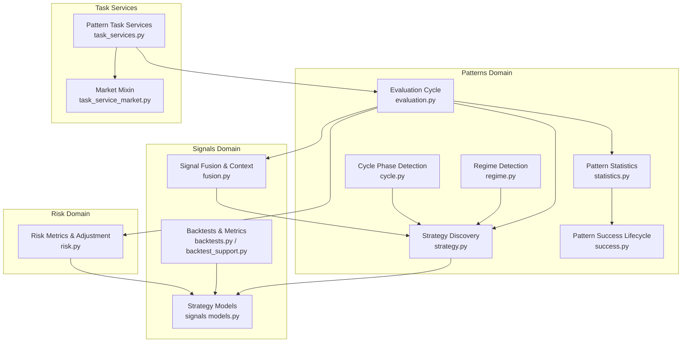

**Diagram sources**
- [strategy.py:334-441](file://src/apps/patterns/domain/strategy.py#L334-L441)
- [evaluation.py:12-26](file://src/apps/patterns/domain/evaluation.py#L12-L26)
- [regime.py:25-66](file://src/apps/patterns/domain/regime.py#L25-L66)
- [cycle.py:65-101](file://src/apps/patterns/domain/cycle.py#L65-L101)
- [statistics.py:101-276](file://src/apps/patterns/domain/statistics.py#L101-L276)
- [success.py:128-277](file://src/apps/patterns/domain/success.py#L128-L277)
- [models.py:168-236](file://src/apps/signals/models.py#L168-L236)
- [fusion.py:71-94](file://src/apps/signals/fusion.py#L71-L94)
- [backtests.py:26-271](file://src/apps/signals/backtests.py#L26-L271)
- [backtest_support.py:34-69](file://src/apps/signals/backtest_support.py#L34-L69)
- [risk.py:160-357](file://src/apps/patterns/domain/risk.py#L160-L357)
- [task_services.py:27-166](file://src/apps/patterns/task_services.py#L27-L166)
- [task_service_market.py:161-188](file://src/apps/patterns/task_service_market.py#L161-L188)

**Section sources**
- [strategy.py:1-491](file://src/apps/patterns/domain/strategy.py#L1-L491)
- [models.py:1-237](file://src/apps/signals/models.py#L1-L237)
- [task_services.py:1-166](file://src/apps/patterns/task_services.py#L1-L166)

## Core Components
- Strategy definition and discovery: automatic candidate generation from pattern signals, with regime, sector, and cycle filters; performance thresholds determine enablement; upsert maintains rules and performance metrics.
- Strategy evaluation cycle: orchestrated refresh of signal history, pattern statistics, contexts, investment decisions, and final signals.
- Pattern statistics and success lifecycle: rolling-window success rates, temperature-based lifecycle state, and event emission for lifecycle transitions.
- Risk-adjusted decision making: computes risk metrics and adjusts decision strength and confidence based on liquidity, slippage, and volatility risks.
- Backtesting and benchmarking: historical signal outcomes aggregated into performance summaries with Sharpe ratio and drawdown metrics.

Key implementation references:
- Strategy discovery and upsert: [strategy.py:334-441](file://src/apps/patterns/domain/strategy.py#L334-L441)
- Strategy alignment and filtering: [strategy.py:443-491](file://src/apps/patterns/domain/strategy.py#L443-L491)
- Evaluation cycle orchestration: [evaluation.py:12-26](file://src/apps/patterns/domain/evaluation.py#L12-L26)
- Pattern statistics and lifecycle: [statistics.py:101-276](file://src/apps/patterns/domain/statistics.py#L101-L276), [success.py:128-277](file://src/apps/patterns/domain/success.py#L128-L277)
- Risk metrics and adjustment: [risk.py:160-357](file://src/apps/patterns/domain/risk.py#L160-L357)
- Backtests and metrics: [backtests.py:26-271](file://src/apps/signals/backtests.py#L26-L271), [backtest_support.py:34-69](file://src/apps/signals/backtest_support.py#L34-L69)

**Section sources**
- [strategy.py:24-491](file://src/apps/patterns/domain/strategy.py#L24-L491)
- [evaluation.py:12-26](file://src/apps/patterns/domain/evaluation.py#L12-L26)
- [statistics.py:101-276](file://src/apps/patterns/domain/statistics.py#L101-L276)
- [success.py:128-277](file://src/apps/patterns/domain/success.py#L128-L277)
- [risk.py:160-357](file://src/apps/patterns/domain/risk.py#L160-L357)
- [backtests.py:26-271](file://src/apps/signals/backtests.py#L26-L271)
- [backtest_support.py:34-69](file://src/apps/signals/backtest_support.py#L34-L69)

## Architecture Overview
The strategy lifecycle integrates pattern recognition, market regime/cycle detection, and risk-aware decision making. The evaluation cycle ensures continuous updates to strategy performance and pattern success states.

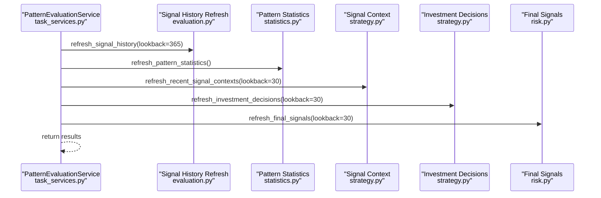

**Diagram sources**
- [task_services.py:27-46](file://src/apps/patterns/task_services.py#L27-L46)
- [evaluation.py:12-26](file://src/apps/patterns/domain/evaluation.py#L12-L26)
- [statistics.py:101-276](file://src/apps/patterns/domain/statistics.py#L101-L276)
- [strategy.py:101-127](file://src/apps/patterns/domain/strategy.py#L101-L127)
- [risk.py:335-357](file://src/apps/patterns/domain/risk.py#L335-L357)

## Detailed Component Analysis

### Strategy Definition Framework
- Candidate generation: builds StrategyCandidate instances from top-ranked pattern tokens, considering regime, sector, and cycle. Tokens are deduplicated and confidence is rounded to discrete buckets.
- Context inference: regime and cycle derived from recent indicators and sector metrics; trend score computed from price and moving averages.
- Outcome computation: terminal return and drawdown measured over a fixed horizon per timeframe; bias determined by weighted signal stack.
- Performance thresholds: sample size, win rate, average return, Sharpe ratio, and maximum drawdown gate whether a strategy is enabled.
- Upsert logic: creates or updates Strategy, StrategyRule entries, and StrategyPerformance; disables previously unseen strategies.

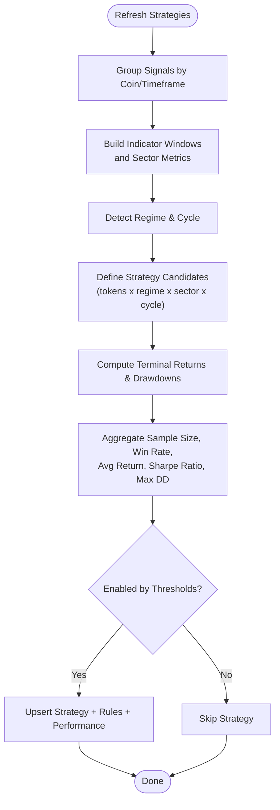

**Diagram sources**
- [strategy.py:334-441](file://src/apps/patterns/domain/strategy.py#L334-L441)
- [regime.py:25-66](file://src/apps/patterns/domain/regime.py#L25-L66)
- [cycle.py:65-101](file://src/apps/patterns/domain/cycle.py#L65-L101)

**Section sources**
- [strategy.py:193-441](file://src/apps/patterns/domain/strategy.py#L193-L441)
- [regime.py:25-66](file://src/apps/patterns/domain/regime.py#L25-L66)
- [cycle.py:65-101](file://src/apps/patterns/domain/cycle.py#L65-L101)

### Rule-Based Pattern Matching and Strategy Alignment
- Strategy rules define allowed pattern slugs with optional regime, sector, and cycle constraints and minimum confidence thresholds.
- Strategy alignment scores strategies by performance metrics and returns matched strategy names.

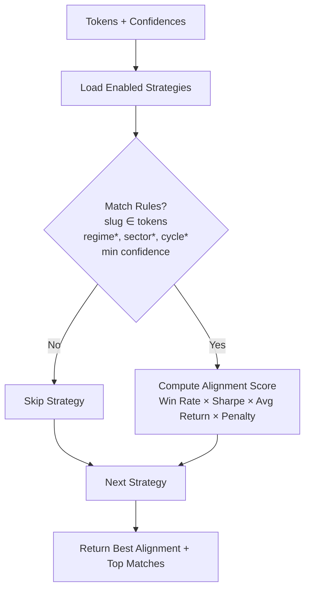

**Diagram sources**
- [strategy.py:443-491](file://src/apps/patterns/domain/strategy.py#L443-L491)
- [models.py:168-236](file://src/apps/signals/models.py#L168-L236)

**Section sources**
- [strategy.py:443-491](file://src/apps/patterns/domain/strategy.py#L443-L491)
- [models.py:195-236](file://src/apps/signals/models.py#L195-L236)

### Regime-Specific Adaptations and Sector/Cycle Considerations
- Regime detection uses trend, volatility, and channel expansion/contraction signals to label market conditions with confidence.
- Sector metrics augment context with sector strength and capital flow.
- Cycle phase inferred from trend score, volatility, price, pattern density, and cluster frequency; combined with regime and sector alignment.

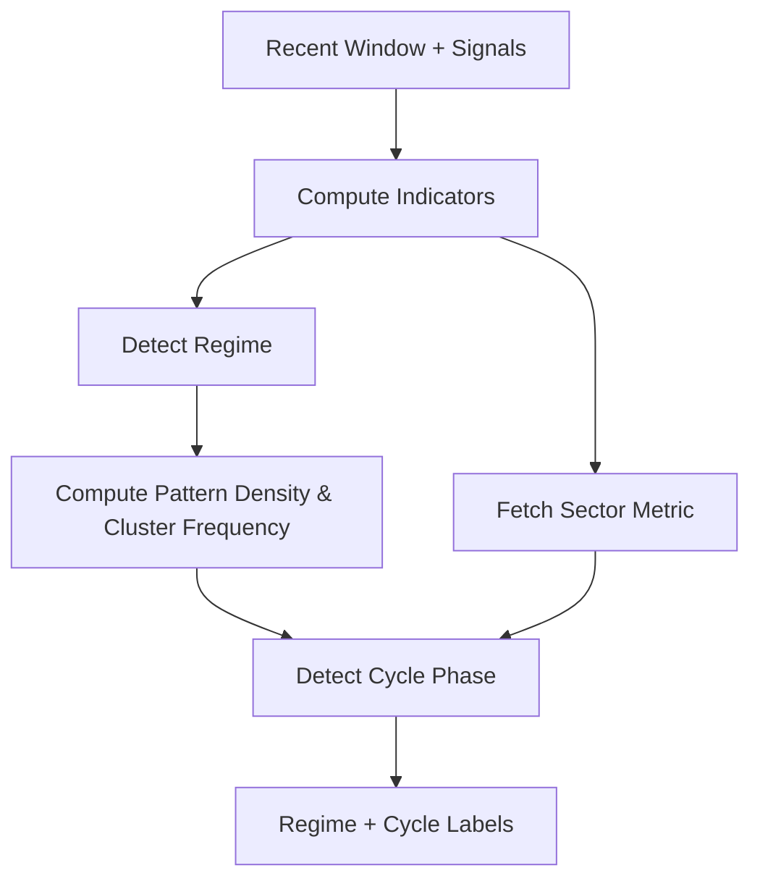

**Diagram sources**
- [regime.py:25-66](file://src/apps/patterns/domain/regime.py#L25-L66)
- [cycle.py:65-101](file://src/apps/patterns/domain/cycle.py#L65-L101)
- [task_service_market.py:161-188](file://src/apps/patterns/task_service_market.py#L161-L188)

**Section sources**
- [regime.py:25-66](file://src/apps/patterns/domain/regime.py#L25-L66)
- [cycle.py:65-101](file://src/apps/patterns/domain/cycle.py#L65-L101)
- [task_service_market.py:161-188](file://src/apps/patterns/task_service_market.py#L161-L188)

### Strategy Performance Tracking System
- Metrics tracked: sample size, win rate, average return, Sharpe ratio, maximum drawdown.
- Sharpe ratio computed from observed returns; thresholds enforce minimum viability.
- StrategyPerformance records are updated during strategy refresh.

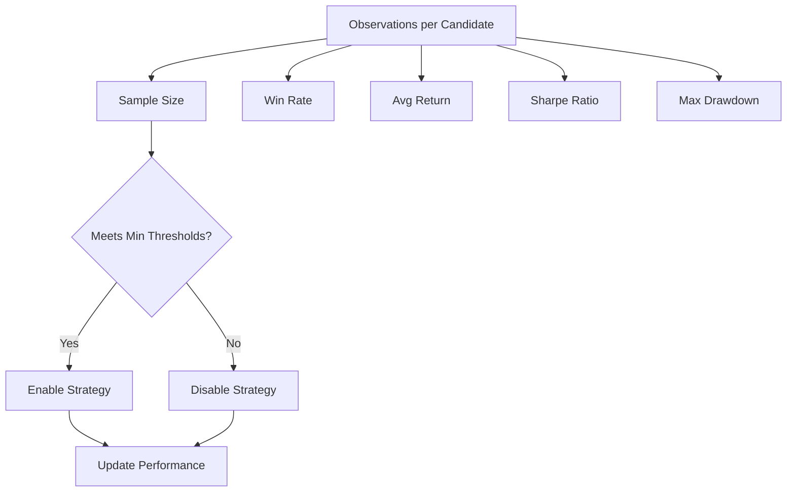

**Diagram sources**
- [strategy.py:388-414](file://src/apps/patterns/domain/strategy.py#L388-L414)
- [strategy.py:260-277](file://src/apps/patterns/domain/strategy.py#L260-L277)
- [models.py:208-223](file://src/apps/signals/models.py#L208-L223)

**Section sources**
- [strategy.py:260-277](file://src/apps/patterns/domain/strategy.py#L260-L277)
- [strategy.py:388-414](file://src/apps/patterns/domain/strategy.py#L388-L414)
- [models.py:208-223](file://src/apps/signals/models.py#L208-L223)

### Strategy Lifecycle Management
- Creation: automatic discovery and upsert of strategies from pattern signals.
- Testing: evaluation cycle runs history refresh, statistics refresh, context enrichment, decisions, and final signals.
- Deployment: strategies are enabled/disabled based on thresholds; only enabled strategies participate in alignment.
- Optimization: pattern success lifecycle adjusts confidence and emits lifecycle events; strategy alignment incorporates performance factors.

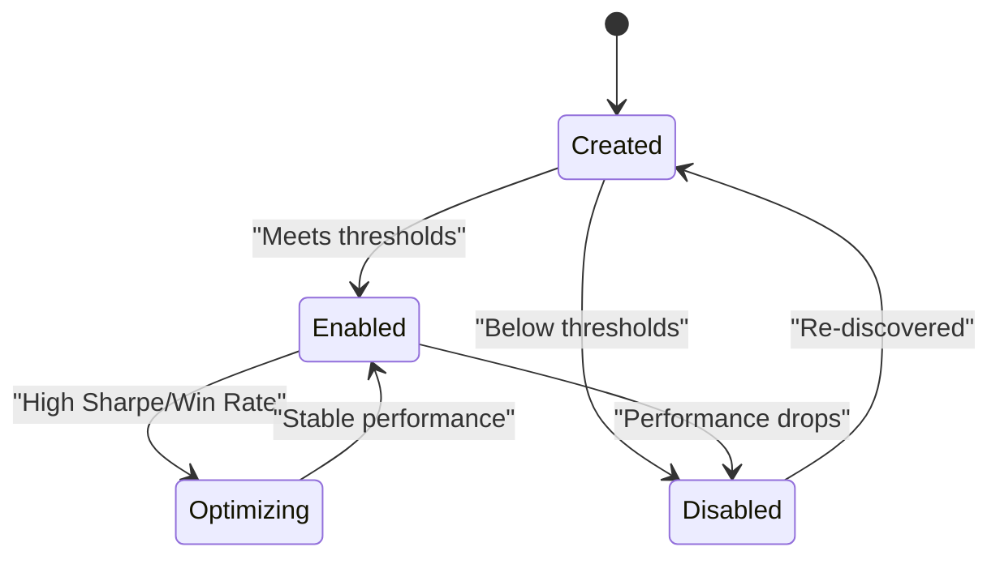

**Diagram sources**
- [strategy.py:270-277](file://src/apps/patterns/domain/strategy.py#L270-L277)
- [success.py:128-277](file://src/apps/patterns/domain/success.py#L128-L277)
- [task_services.py:27-46](file://src/apps/patterns/task_services.py#L27-L46)

**Section sources**
- [strategy.py:270-277](file://src/apps/patterns/domain/strategy.py#L270-L277)
- [success.py:128-277](file://src/apps/patterns/domain/success.py#L128-L277)
- [task_services.py:27-46](file://src/apps/patterns/task_services.py#L27-L46)

### Integration with Pattern Recognition Results and Signal Evaluation
- Pattern statistics provide success rates and temperature used to adjust pattern confidence and lifecycle state.
- Fusion logic retrieves pattern success rates for signals and applies regime-aware adjustments.
- Strategy alignment considers pattern success actions and factors.

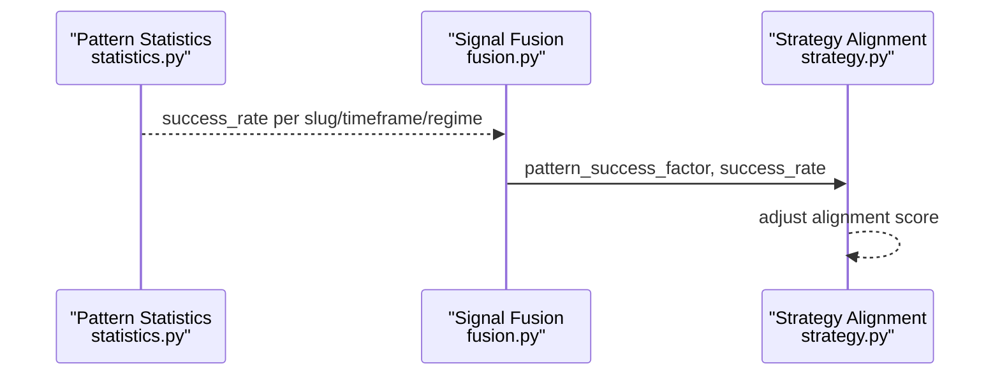

**Diagram sources**
- [statistics.py:101-276](file://src/apps/patterns/domain/statistics.py#L101-L276)
- [fusion.py:71-94](file://src/apps/signals/fusion.py#L71-L94)
- [strategy.py:443-491](file://src/apps/patterns/domain/strategy.py#L443-L491)

**Section sources**
- [statistics.py:101-276](file://src/apps/patterns/domain/statistics.py#L101-L276)
- [fusion.py:71-94](file://src/apps/signals/fusion.py#L71-L94)
- [strategy.py:443-491](file://src/apps/patterns/domain/strategy.py#L443-L491)

### Risk-Adjusted Decision Making
- Risk metrics computed from liquidity, slippage risk, and volatility risk.
- Final signal decision adjusted by risk-adjusted score; confidence scaled accordingly.
- Decision reasons captured for auditability.

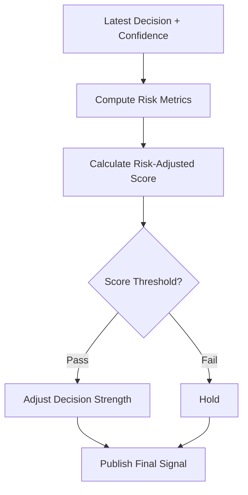

**Diagram sources**
- [risk.py:235-322](file://src/apps/patterns/domain/risk.py#L235-L322)

**Section sources**
- [risk.py:160-357](file://src/apps/patterns/domain/risk.py#L160-L357)
- [models.py:83-127](file://src/apps/signals/models.py#L83-L127)

### Performance Benchmarking and Backtesting
- Historical outcomes aggregated per signal type and timeframe; Sharpe ratio and drawdown computed.
- Backtests expose top-performing patterns and per-symbol results.

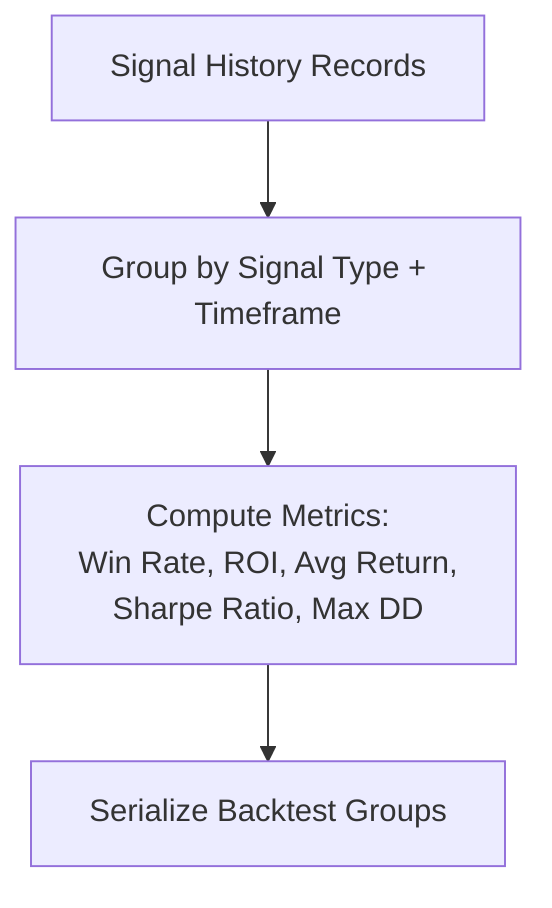

**Diagram sources**
- [backtests.py:45-138](file://src/apps/signals/backtests.py#L45-L138)
- [backtest_support.py:34-69](file://src/apps/signals/backtest_support.py#L34-L69)

**Section sources**
- [backtests.py:26-271](file://src/apps/signals/backtests.py#L26-L271)
- [backtest_support.py:34-69](file://src/apps/signals/backtest_support.py#L34-L69)

## Dependency Analysis
- Strategy depends on StrategyRule and StrategyPerformance relationships; StrategyRule embeds pattern slug and context filters.
- Strategy discovery depends on pattern statistics for success rates and temperature; also uses regime and cycle detection.
- Risk-adjusted decisions depend on latest decision and computed risk metrics; publishes final signals.

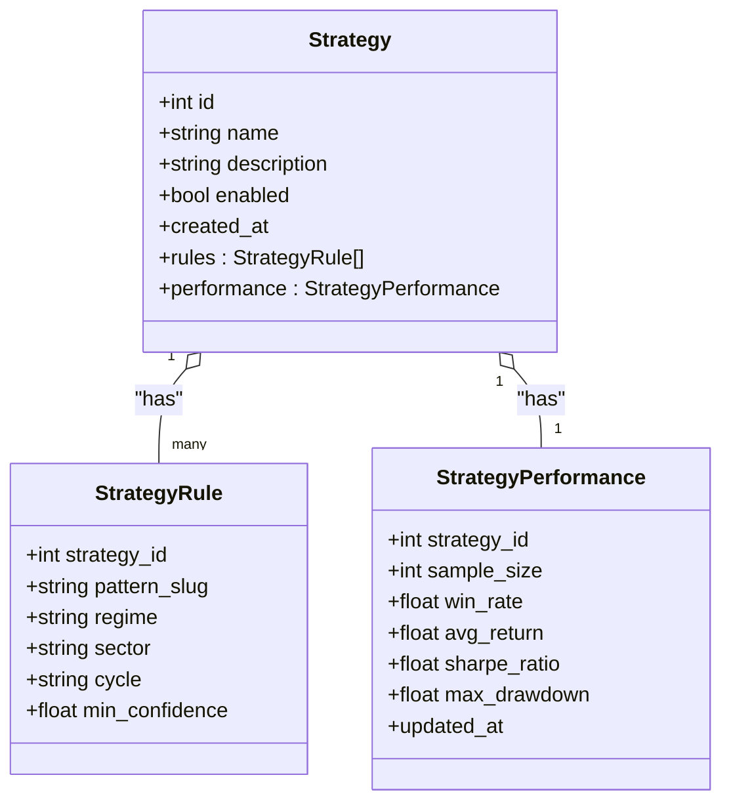

**Diagram sources**
- [models.py:168-236](file://src/apps/signals/models.py#L168-L236)

**Section sources**
- [models.py:168-236](file://src/apps/signals/models.py#L168-L236)

## Performance Considerations
- Strategy discovery caps candidate count and requires minimum sample size to avoid overfitting.
- Sharpe ratio threshold ensures positive risk-adjusted returns.
- Rolling windows in pattern statistics prevent stale signals from dominating lifecycle decisions.
- Risk-adjusted decisions avoid unnecessary trades when risk-adjusted score is below thresholds.

[No sources needed since this section provides general guidance]

## Troubleshooting Guide
- Strategies not appearing: verify evaluation cycle ran and strategies meet minimum sample size and thresholds.
- Low strategy enablement: check pattern success rates and lifecycle state; confirm sufficient samples and success rate thresholds.
- Risk-adjusted signals unchanged: compare material delta thresholds for score and confidence; ensure new decision differs meaningfully.
- Backtest discrepancies: confirm lookback windows and grouping criteria; ensure result_return/result_drawdown are populated.

**Section sources**
- [strategy.py:270-277](file://src/apps/patterns/domain/strategy.py#L270-L277)
- [success.py:128-277](file://src/apps/patterns/domain/success.py#L128-L277)
- [risk.py:274-291](file://src/apps/patterns/domain/risk.py#L274-L291)
- [backtests.py:45-138](file://src/apps/signals/backtests.py#L45-L138)

## Conclusion
The strategy development system combines automated discovery, regime/cycle-aware adaptation, and robust performance tracking with risk-adjusted decision making. The evaluation cycle continuously refines strategies and patterns, while lifecycle mechanisms ensure only viable strategies remain active. Backtesting and benchmarking provide quantitative validation against market conditions.

[No sources needed since this section summarizes without analyzing specific files]

## Appendices

### Practical Examples and Optimization Techniques
- Constructing a strategy: combine top pattern tokens, constrain by regime and cycle, and set minimum confidence thresholds; review performance metrics and enable/disable accordingly.
- Parameter optimization: adjust minimum sample size, win rate, Sharpe ratio, and drawdown thresholds to balance discovery vs. stability; monitor pattern success lifecycle transitions.
- Benchmarking: compare strategies via Sharpe ratio, win rate, and maximum drawdown; use backtests to validate across symbols and timeframes.

[No sources needed since this section provides general guidance]