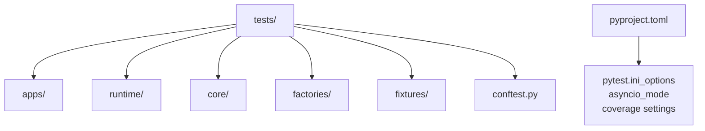
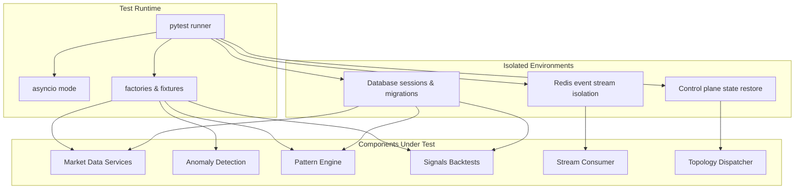
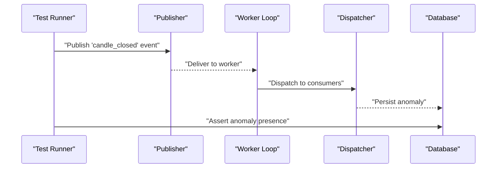
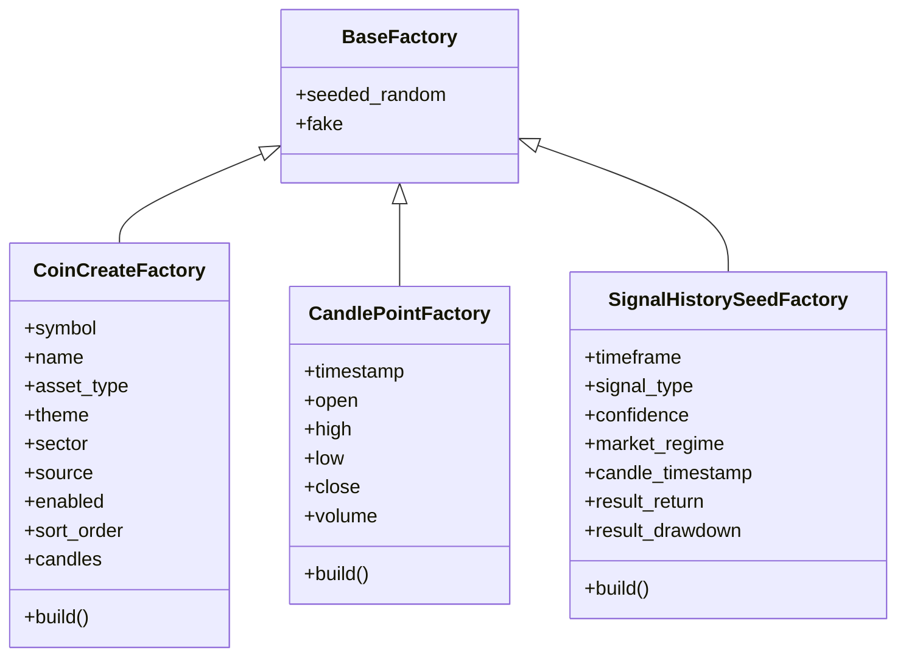
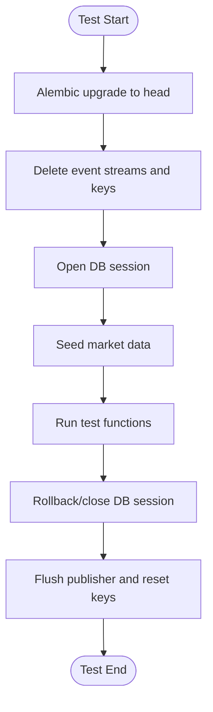
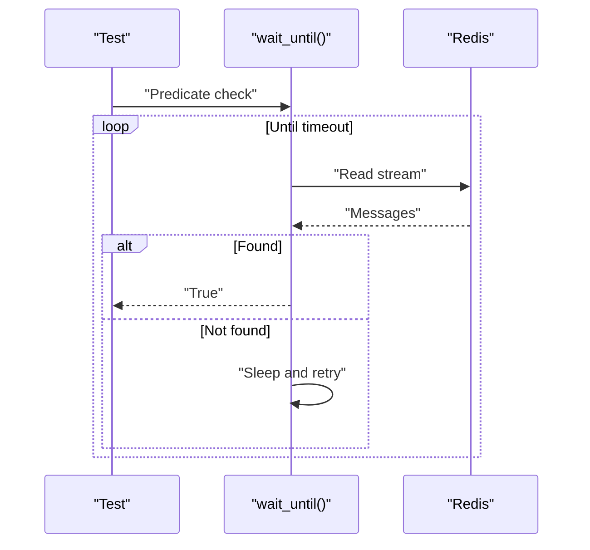
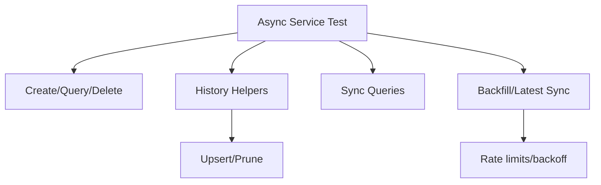
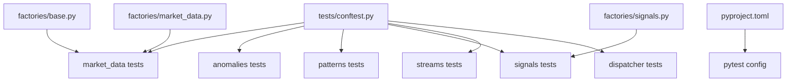

# Testing Strategy

<cite>
**Referenced Files in This Document**
- [tests/conftest.py](file://tests/conftest.py)
- [pyproject.toml](file://pyproject.toml)
- [tests/factories/base.py](file://tests/factories/base.py)
- [tests/factories/market_data.py](file://tests/factories/market_data.py)
- [tests/factories/signals.py](file://tests/factories/signals.py)
- [tests/apps/market_data/test_services.py](file://tests/apps/market_data/test_services.py)
- [tests/apps/market_data/test_sources_providers.py](file://tests/apps/market_data/test_sources_providers.py)
- [tests/apps/anomalies/test_detectors_and_scoring.py](file://tests/apps/anomalies/test_detectors_and_scoring.py)
- [tests/apps/anomalies/test_pipeline.py](file://tests/apps/anomalies/test_pipeline.py)
- [tests/apps/patterns/test_domain_orchestration.py](file://tests/apps/patterns/test_domain_orchestration.py)
- [tests/apps/patterns/test_services_async.py](file://tests/apps/patterns/test_services_async.py)
- [tests/apps/signals/test_backtests.py](file://tests/apps/signals/test_backtests.py)
- [tests/runtime/streams/test_consumer.py](file://tests/runtime/streams/test_consumer.py)
- [tests/runtime/control_plane/test_dispatcher.py](file://tests/runtime/control_plane/test_dispatcher.py)
</cite>

## Table of Contents
1. [Introduction](#introduction)
2. [Project Structure](#project-structure)
3. [Core Components](#core-components)
4. [Architecture Overview](#architecture-overview)
5. [Detailed Component Analysis](#detailed-component-analysis)
6. [Dependency Analysis](#dependency-analysis)
7. [Performance Considerations](#performance-considerations)
8. [Troubleshooting Guide](#troubleshooting-guide)
9. [Conclusion](#conclusion)
10. [Appendices](#appendices)

## Introduction
This document describes the testing strategy and approach used in the IRIS platform. It covers unit and integration testing methodologies, test factory and fixture management, asynchronous testing patterns, database testing with pytest, worker process testing, and continuous integration setup. The goal is to provide a comprehensive guide for contributors to understand how tests are structured, how to write effective tests, and how to maintain quality and reliability across the system.

## Project Structure
The repository organizes tests under a dedicated tests directory with a package-like layout mirroring the application structure. Centralized fixtures and factories are provided to support deterministic and reusable test data. The pytest configuration is defined in the project configuration file.

**Diagram sources**
- [tests/conftest.py:1-448](file://tests/conftest.py#L1-L448)
- [pyproject.toml:41-89](file://pyproject.toml#L41-L89)

**Section sources**
- [tests/conftest.py:1-448](file://tests/conftest.py#L1-L448)
- [pyproject.toml:41-89](file://pyproject.toml#L41-L89)

## Core Components
- Centralized fixtures and teardown logic for database, Redis event streams, and control plane state isolation.
- Deterministic test factories for generating model instances and synthetic datasets.
- Async-first test suite leveraging pytest-asyncio for coroutine-based tests.
- Comprehensive integration tests validating end-to-end pipelines and worker processes.

Key capabilities:
- Database migration and session fixtures for transactional tests.
- Redis event stream isolation and publisher reset for stream-based tests.
- Control plane topology restoration and audit seeding for routing tests.
- Factories for market data, signals, and shared utilities.

**Section sources**
- [tests/conftest.py:91-153](file://tests/conftest.py#L91-L153)
- [tests/conftest.py:155-291](file://tests/conftest.py#L155-L291)
- [tests/conftest.py:413-448](file://tests/conftest.py#L413-L448)
- [tests/factories/base.py:1-18](file://tests/factories/base.py#L1-L18)
- [tests/factories/market_data.py:1-89](file://tests/factories/market_data.py#L1-L89)
- [tests/factories/signals.py:1-39](file://tests/factories/signals.py#L1-L39)

## Architecture Overview
The testing architecture emphasizes:
- Isolation: per-test Redis stream cleanup and database transaction rollback.
- Determinism: seeded randomization and factories for reproducible datasets.
- Asynchrony: native async fixtures and coroutine-based tests.
- Integration: end-to-end tests for event-driven pipelines and worker processes.

**Diagram sources**
- [tests/conftest.py:91-153](file://tests/conftest.py#L91-L153)
- [tests/conftest.py:155-291](file://tests/conftest.py#L155-L291)
- [tests/apps/market_data/test_services.py:50-110](file://tests/apps/market_data/test_services.py#L50-L110)
- [tests/apps/anomalies/test_pipeline.py:67-142](file://tests/apps/anomalies/test_pipeline.py#L67-L142)
- [tests/apps/patterns/test_domain_orchestration.py:256-311](file://tests/apps/patterns/test_domain_orchestration.py#L256-L311)
- [tests/apps/signals/test_backtests.py:40-136](file://tests/apps/signals/test_backtests.py#L40-L136)
- [tests/runtime/streams/test_consumer.py:65-92](file://tests/runtime/streams/test_consumer.py#L65-L92)
- [tests/runtime/control_plane/test_dispatcher.py:76-206](file://tests/runtime/control_plane/test_dispatcher.py#L76-L206)

## Detailed Component Analysis

### Unit Testing Methodology
- Async-first tests using pytest-asyncio markers and async fixtures.
- Mocking external dependencies via monkeypatch to isolate units.
- Factory-driven data creation for deterministic assertions.

Representative examples:
- Async service tests for market data operations.
- Provider-specific parsing and error handling tests for market data sources.
- Pattern domain orchestration and guard branches.

**Section sources**
- [tests/apps/market_data/test_services.py:50-110](file://tests/apps/market_data/test_services.py#L50-L110)
- [tests/apps/market_data/test_sources_providers.py:41-76](file://tests/apps/market_data/test_sources_providers.py#L41-L76)
- [tests/apps/patterns/test_domain_orchestration.py:29-44](file://tests/apps/patterns/test_domain_orchestration.py#L29-L44)

### Integration Testing Patterns
- End-to-end event-driven pipelines with Redis-backed streams.
- Worker process simulation using multiprocessing for dispatcher and consumer loops.
- Database-backed persistence checks for anomaly enrichment and signal history.

**Diagram sources**
- [tests/apps/anomalies/test_pipeline.py:67-142](file://tests/apps/anomalies/test_pipeline.py#L67-L142)

**Section sources**
- [tests/apps/anomalies/test_pipeline.py:67-142](file://tests/apps/anomalies/test_pipeline.py#L67-L142)
- [tests/runtime/streams/test_consumer.py:65-92](file://tests/runtime/streams/test_consumer.py#L65-L92)
- [tests/runtime/control_plane/test_dispatcher.py:76-206](file://tests/runtime/control_plane/test_dispatcher.py#L76-L206)

### Test Factory Implementations
- Shared seed for deterministic randomness across tests.
- Pydantic and dataclass factories for model creation.
- Specialized builders for candle series and synthetic histories.

**Diagram sources**
- [tests/factories/base.py:1-18](file://tests/factories/base.py#L1-L18)
- [tests/factories/market_data.py:19-89](file://tests/factories/market_data.py#L19-L89)
- [tests/factories/signals.py:12-39](file://tests/factories/signals.py#L12-L39)

**Section sources**
- [tests/factories/base.py:1-18](file://tests/factories/base.py#L1-L18)
- [tests/factories/market_data.py:19-89](file://tests/factories/market_data.py#L19-L89)
- [tests/factories/signals.py:12-39](file://tests/factories/signals.py#L12-L39)

### Fixture Management
- Session-scoped settings and database migrations.
- Per-session Redis event stream isolation and publisher reset.
- Database cleanup fixtures for multiple domains (portfolio, patterns, anomalies, etc.).
- Seeded market data for downstream components.

**Diagram sources**
- [tests/conftest.py:91-153](file://tests/conftest.py#L91-L153)
- [tests/conftest.py:155-291](file://tests/conftest.py#L155-L291)
- [tests/conftest.py:413-448](file://tests/conftest.py#L413-L448)

**Section sources**
- [tests/conftest.py:91-153](file://tests/conftest.py#L91-L153)
- [tests/conftest.py:155-291](file://tests/conftest.py#L155-L291)
- [tests/conftest.py:413-448](file://tests/conftest.py#L413-L448)

### Testing Architecture
- Async fixtures for database and Redis.
- Monkeypatching for external provider APIs and internal helpers.
- Parameterized and branch-focused tests for error and guard paths.

Examples:
- Async service CRUD and history helpers for market data.
- Provider-specific payload parsing and error propagation.
- Pattern detection and orchestration with guard conditions.

**Section sources**
- [tests/apps/market_data/test_services.py:111-272](file://tests/apps/market_data/test_services.py#L111-L272)
- [tests/apps/market_data/test_sources_providers.py:41-76](file://tests/apps/market_data/test_sources_providers.py#L41-L76)
- [tests/apps/patterns/test_domain_orchestration.py:256-311](file://tests/apps/patterns/test_domain_orchestration.py#L256-L311)

### Mock Strategies
- Patching external HTTP clients and rate-limiting exceptions.
- Replacing internal helpers with controlled return values or side effects.
- Using SimpleNamespace and fake sessions to simulate database responses.

**Section sources**
- [tests/apps/market_data/test_sources_providers.py:343-350](file://tests/apps/market_data/test_sources_providers.py#L343-L350)
- [tests/apps/patterns/test_services_async.py:298-373](file://tests/apps/patterns/test_services_async.py#L298-L373)

### Test Data Management
- Seeded factories for deterministic datasets.
- Synthetic candle series builders for anomaly and pattern tests.
- Signal history seeds for backtesting computations.

**Section sources**
- [tests/factories/market_data.py:62-89](file://tests/factories/market_data.py#L62-L89)
- [tests/apps/anomalies/test_detectors_and_scoring.py:23-84](file://tests/apps/anomalies/test_detectors_and_scoring.py#L23-L84)
- [tests/apps/signals/test_backtests.py:40-83](file://tests/apps/signals/test_backtests.py#L40-L83)

### Asynchronous Testing Patterns
- Async fixtures for database sessions and Redis clients.
- Coroutine-based consumers and dispatchers tested with mocked Redis.
- Wait-until helpers for eventual consistency checks.

**Diagram sources**
- [tests/conftest.py:74-88](file://tests/conftest.py#L74-L88)
- [tests/apps/anomalies/test_pipeline.py:101-110](file://tests/apps/anomalies/test_pipeline.py#L101-L110)

**Section sources**
- [tests/conftest.py:74-88](file://tests/conftest.py#L74-L88)
- [tests/runtime/streams/test_consumer.py:138-224](file://tests/runtime/streams/test_consumer.py#L138-L224)

### Database Testing with pytest
- Alembic migration fixture to ensure schema consistency.
- Session fixtures for transactional tests with rollback.
- Cleanup fixtures per domain to avoid cross-test contamination.

**Section sources**
- [tests/conftest.py:96-103](file://tests/conftest.py#L96-L103)
- [tests/conftest.py:155-162](file://tests/conftest.py#L155-L162)
- [tests/conftest.py:170-291](file://tests/conftest.py#L170-L291)

### Worker Process Testing
- Multiprocessing-based dispatcher and worker loops for end-to-end tests.
- Controlled process lifecycle with termination and join timeouts.

**Section sources**
- [tests/apps/anomalies/test_pipeline.py:47-58](file://tests/apps/anomalies/test_pipeline.py#L47-L58)
- [tests/apps/anomalies/test_pipeline.py:60-65](file://tests/apps/anomalies/test_pipeline.py#L60-L65)

### Market Data Testing
- Async service tests covering create/query/delete and history helpers.
- Provider-specific tests for payload parsing and error propagation.
- Branch coverage for backfill and latest sync logic.

**Diagram sources**
- [tests/apps/market_data/test_services.py:50-110](file://tests/apps/market_data/test_services.py#L50-L110)
- [tests/apps/market_data/test_services.py:111-272](file://tests/apps/market_data/test_services.py#L111-L272)
- [tests/apps/market_data/test_sources_providers.py:41-76](file://tests/apps/market_data/test_sources_providers.py#L41-L76)

**Section sources**
- [tests/apps/market_data/test_services.py:50-110](file://tests/apps/market_data/test_services.py#L50-L110)
- [tests/apps/market_data/test_services.py:111-272](file://tests/apps/market_data/test_services.py#L111-L272)
- [tests/apps/market_data/test_sources_providers.py:41-76](file://tests/apps/market_data/test_sources_providers.py#L41-L76)

### Pattern Recognition Testing
- Domain orchestration tests for clustering, hierarchy, cycle detection, and narratives.
- Guard branches for disabled features and insufficient data.
- Pattern engine incremental bootstrap and history paths.

**Section sources**
- [tests/apps/patterns/test_domain_orchestration.py:46-140](file://tests/apps/patterns/test_domain_orchestration.py#L46-L140)
- [tests/apps/patterns/test_domain_orchestration.py:142-254](file://tests/apps/patterns/test_domain_orchestration.py#L142-L254)
- [tests/apps/patterns/test_domain_orchestration.py:256-311](file://tests/apps/patterns/test_domain_orchestration.py#L256-L311)
- [tests/apps/patterns/test_services_async.py:18-125](file://tests/apps/patterns/test_services_async.py#L18-L125)

### Anomaly Detection Testing
- Detector-specific tests for price/volume/spike and structural anomalies.
- Scoring tests mapping component scores to severity.
- Pipeline tests for anomaly detection and enrichment.

**Section sources**
- [tests/apps/anomalies/test_detectors_and_scoring.py:130-411](file://tests/apps/anomalies/test_detectors_and_scoring.py#L130-L411)
- [tests/apps/anomalies/test_pipeline.py:67-142](file://tests/apps/anomalies/test_pipeline.py#L67-L142)
- [tests/apps/anomalies/test_pipeline.py:144-233](file://tests/apps/anomalies/test_pipeline.py#L144-L233)

### Signal Generation and Backtests Testing
- Backtest math helpers and serialization for performance metrics.
- Query coverage for grouped and filtered signal history.
- Signal history seeds for deterministic ROI and drawdown computations.

**Section sources**
- [tests/apps/signals/test_backtests.py:14-38](file://tests/apps/signals/test_backtests.py#L14-L38)
- [tests/apps/signals/test_backtests.py:40-136](file://tests/apps/signals/test_backtests.py#L40-L136)
- [tests/factories/signals.py:12-39](file://tests/factories/signals.py#L12-L39)

### Stream Consumer and Dispatcher Testing
- Event consumer process message branches and metrics recording.
- Dispatcher filter, scope, throttling, and shadow mode behavior.
- Error handling and retry logic for Redis operations.

**Section sources**
- [tests/runtime/streams/test_consumer.py:65-92](file://tests/runtime/streams/test_consumer.py#L65-L92)
- [tests/runtime/streams/test_consumer.py:138-224](file://tests/runtime/streams/test_consumer.py#L138-L224)
- [tests/runtime/control_plane/test_dispatcher.py:76-206](file://tests/runtime/control_plane/test_dispatcher.py#L76-L206)

## Dependency Analysis
The testing suite exhibits strong cohesion around domain areas and loose coupling between test modules. Central fixtures reduce duplication and ensure consistent environment setup.

**Diagram sources**
- [tests/conftest.py:1-448](file://tests/conftest.py#L1-L448)
- [tests/factories/base.py:1-18](file://tests/factories/base.py#L1-L18)
- [tests/factories/market_data.py:1-89](file://tests/factories/market_data.py#L1-L89)
- [tests/factories/signals.py:1-39](file://tests/factories/signals.py#L1-L39)
- [pyproject.toml:41-89](file://pyproject.toml#L41-L89)

**Section sources**
- [tests/conftest.py:1-448](file://tests/conftest.py#L1-L448)
- [pyproject.toml:41-89](file://pyproject.toml#L41-L89)

## Performance Considerations
- Prefer async fixtures and coroutine-based tests to minimize overhead.
- Use factories and seeded randomness to avoid expensive external calls.
- Keep integration tests scoped and fast by mocking external systems where appropriate.
- Leverage cleanup fixtures to prevent test drift and resource leakage.

## Troubleshooting Guide
Common issues and resolutions:
- Redis connectivity errors during stream tests: ensure Redis fixture isolation and publisher reset are active.
- Database contention: rely on per-test session and cleanup fixtures.
- Timing-sensitive assertions: use wait-until helpers for eventual consistency checks.
- Provider API changes: update monkeypatched responses and error conditions in provider tests.

**Section sources**
- [tests/conftest.py:74-88](file://tests/conftest.py#L74-L88)
- [tests/runtime/streams/test_consumer.py:180-200](file://tests/runtime/streams/test_consumer.py#L180-L200)
- [tests/apps/market_data/test_sources_providers.py:343-350](file://tests/apps/market_data/test_sources_providers.py#L343-L350)

## Conclusion
The IRIS testing strategy emphasizes determinism, isolation, and comprehensiveness across units, integrations, and end-to-end pipelines. Central fixtures, factories, and async-first patterns enable reliable and maintainable tests. The approach balances thoroughness with performance, ensuring robust coverage for market data, pattern recognition, anomaly detection, and signal generation, while supporting asynchronous and worker-based workflows.

## Appendices
- Continuous Integration Setup: Configure pytest with asyncio mode and coverage reporting as defined in the project configuration.
- Test Coverage Requirements: Enable coverage collection for the src directory and enforce minimum thresholds in CI.

**Section sources**
- [pyproject.toml:41-89](file://pyproject.toml#L41-L89)